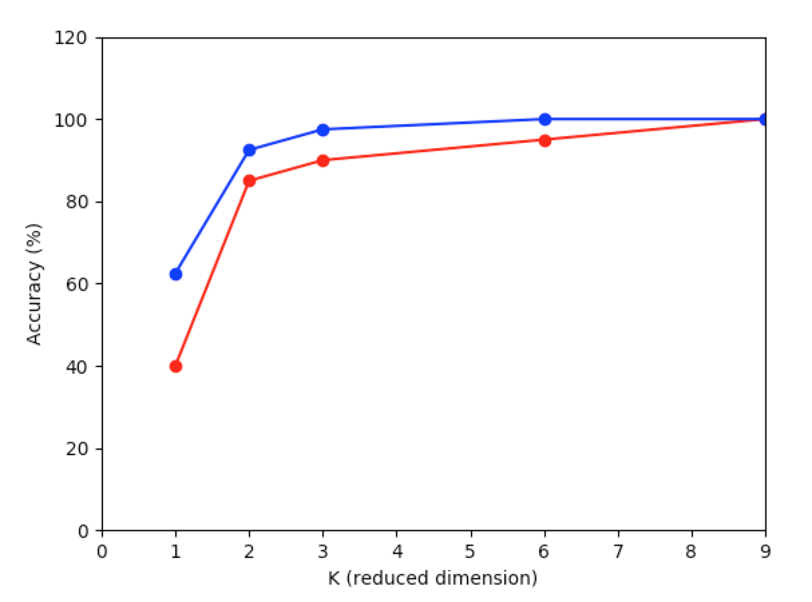
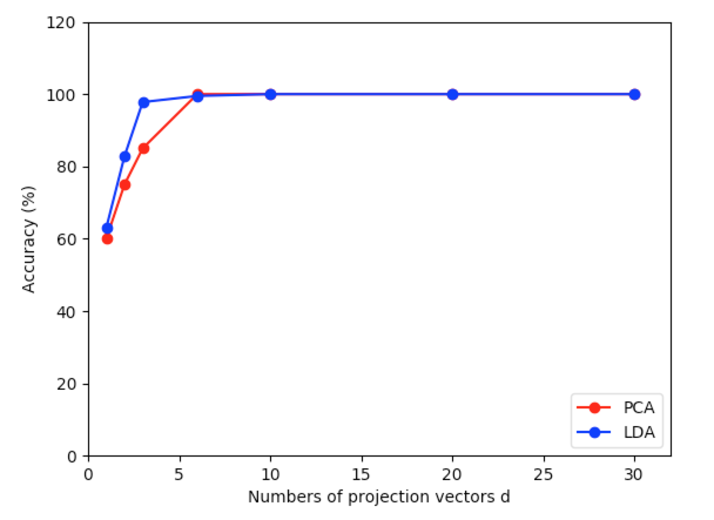

# Classification based on dimension reduction algorithms: PCA vs LDA

- Compare Principal Component Analysis (PCA) with Linear Discriminant Analysis (LDA) / Fisher Linear Discriminant (FLD).
- Use both algorithms to reduce image features into `d` dimension and classify different people with the reduced facial features.
- The result shows that LDA works better than PCA in smaller dimensions.
- Plot the accuracy rate vs reduced dimension `d`.

## Demo

> Dimension d = [1, 2, 3, 6, 9]



> Dimension d = [1, 2, 3, 6, 10, 20, 30]



## Get started

> First time

```bash
make all
```

> After first time

```bash
make start
```


## Dependency:

- Python 3+
- numpy
- sklearn
- opencv-python
- matplotlib
